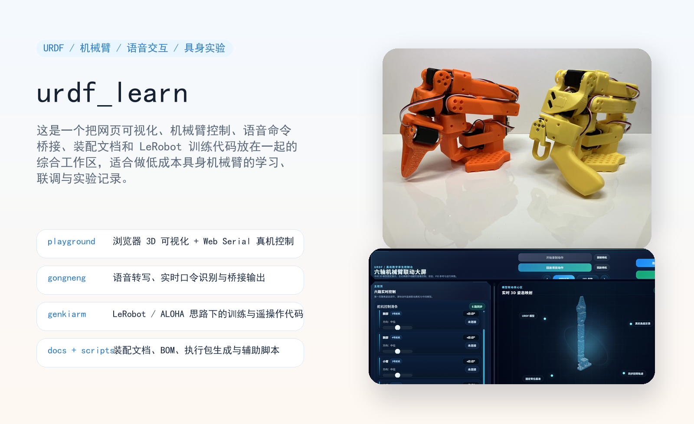
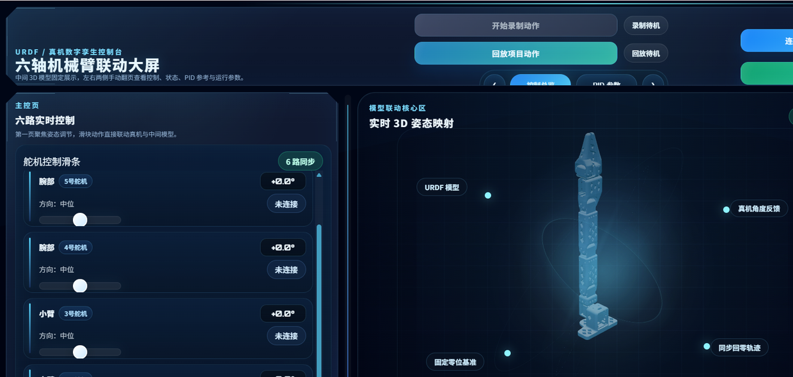
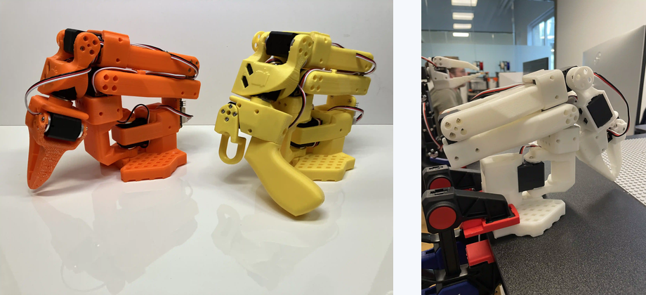
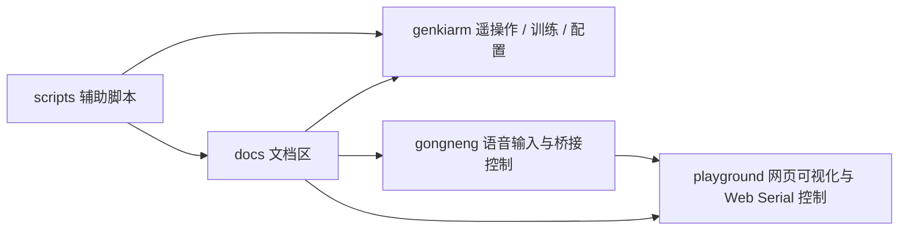

# urdf_learn



一个围绕 `URDF / 机械臂 / 具身智能 / 真机控制 / 语音交互` 搭建的综合学习与实验工作区。

这个仓库不是单一 demo，而是把文档、网页控制面板、语音工具、机械臂训练与遥操作代码、辅助脚本都集中到了同一个 workspace 里，适合做持续迭代、联调和记录沉淀。

## 你可以把它理解成什么

- 一个机械臂学习工作台
- 一个真机控制 + 网页可视化实验场
- 一个语音指令驱动机械臂的入口
- 一个 LeRobot / ALOHA 思路下的低成本具身智能实践仓库

## 效果预览

### 浏览器端机械臂面板



### 硬件与项目概览



### 工作区模块关系



## 仓库里有什么

| 目录 | 作用 |
| --- | --- |
| `docs/` | 采购、装配、接线、采集流程、执行说明等项目文档 |
| `playground/` | 浏览器端 URDF 可视化、Web Serial 真机控制与桥接执行面板 |
| `gongneng/` | 语音转文字、实时语音控制、桥接输出等工具 |
| `genkiarm/` | 基于 ALOHA / LeRobot 思路整理的低成本机械臂代码与配置 |
| `scripts/` | BOM 生成、执行方案、舵机角度读取等辅助脚本 |
| `归档/` | 历史 STL 模型与阶段性归档文件 |

## 主要能力

- 机械臂 URDF 网页可视化
- 浏览器端真机连接与控制
- 语音识别到机械臂动作桥接
- 低成本具身机械臂遥操作与训练实验
- 文档、接线、采集流程与执行方案沉淀

## 推荐阅读顺序

如果你第一次进入这个仓库，建议按下面顺序看:

1. 先看 `docs/`，了解硬件方案、接线和整体目标
2. 再看 `playground/`，最快看到可交互的效果
3. 再看 `gongneng/`，理解语音输入和桥接执行链路
4. 最后看 `genkiarm/`，深入到 LeRobot、遥操作和训练代码

## 快速开始

### 1. 先跑浏览器控制面板

```powershell
cd playground
npm install
npm run dev
```

说明:

- `playground` 基于 `Vite + three.js + urdf-loader`
- 支持虚拟机械臂显示
- 支持通过 `Web Serial API` 连接真实机械臂
- 可以监听 `robot_command_bridge.jsonl` 来接收语音模块输出的动作命令

建议使用较新的 Node.js 版本运行，优先 `Node.js 18+`。

### 2. 体验语音工具

```powershell
python -m pip install -r gongneng\requirements.txt
python gongneng\voice_to_text_terminal.py
```

实时语音版:

```powershell
python gongneng\realtime_voice_command_terminal.py
```

它们适合两类场景:

- `voice_to_text_terminal.py`: 录一段再整体转文字
- `realtime_voice_command_terminal.py`: 边说边出字，并写出桥接动作文件

### 3. 查看 GenkiArm / LeRobot 路线

如果你想继续深入到具身训练与遥操作，可以从 `genkiarm` 开始。

推荐先看:

- `genkiarm/README.md`
- `genkiarm/lerobot/configs`
- `genkiarm/lerobot/scripts`

根据当前仓库说明，典型环境准备方式是:

```powershell
conda create -y -n jszn python=3.10
conda activate jszn
cd genkiarm\lerobot
pip install -e .
pip install -r requirements.txt
pip install pyserial
```

测试遥操作示例:

```powershell
python lerobot/scripts/control_robot.py teleoperate --robot-path lerobot/configs/robot/so100.yaml --robot-overrides "~cameras" --display-cameras 0
```

## 语音到真机执行链路

`gongneng/` 目录已经把这条链路做成了可拆分组合的形式:

1. 麦克风采集
2. 实时或整段语音转写
3. 规则或 AI 指令理解
4. 输出 `robot_command_bridge.jsonl`
5. `playground` 监听桥接文件并执行动作

这意味着你既可以单独测试语音模块，也可以和网页控制面板联动起来。

## 项目结构

```text
urdf_learn/
├─ docs/                    硬件、接线、执行与采集文档
├─ genkiarm/                具身机械臂代码、LeRobot 配置与脚本
├─ gongneng/                语音转写、实时语音、桥接控制工具
├─ playground/              网页可视化与 Web Serial 控制面板
├─ scripts/                 各类辅助脚本
├─ docs/assets/             README 展示图
└─ 归档/                    历史模型与归档文件
```

## 适合什么人

- 想学 URDF 和机械臂可视化的人
- 想把浏览器控制和真机连接串起来的人
- 想做语音控制机械臂入口原型的人
- 想尝试低成本具身智能 / LeRobot 实验的人

## 使用提示

- `Web Serial API` 通常更适合 Chromium 内核浏览器
- 真机控制前请先确认舵机零位、供电和动作范围
- 语音模块如果走在线转写，需要提前配置 `OPENAI_API_KEY`
- 如果你只想快速看效果，优先从 `playground` 开始最直观

## 说明

这个仓库更像一个“长期实验工作区”，不是单页式 demo。它的价值在于把文档、控制链路、语音入口和训练路线放在一起，便于你持续扩展。
